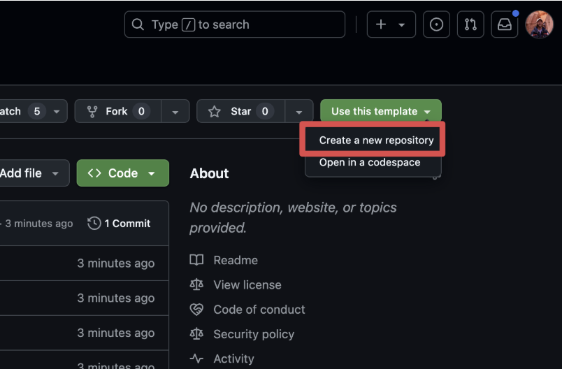
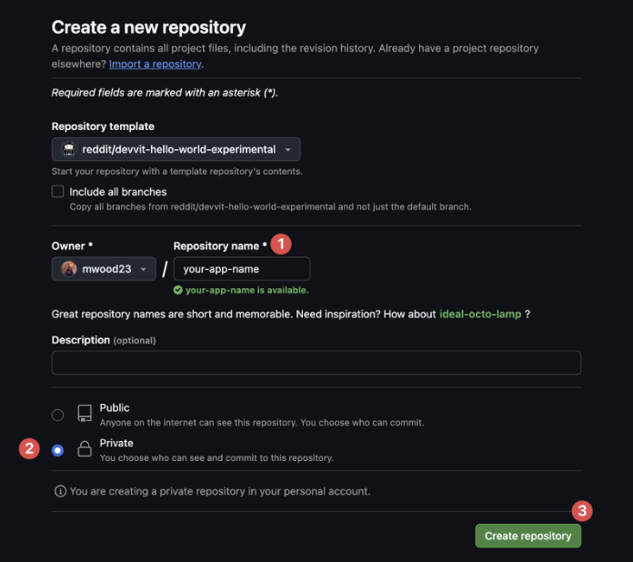
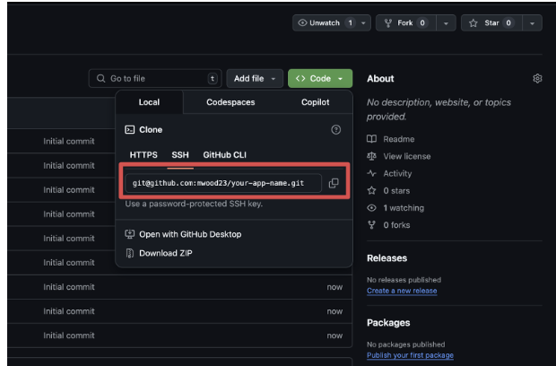
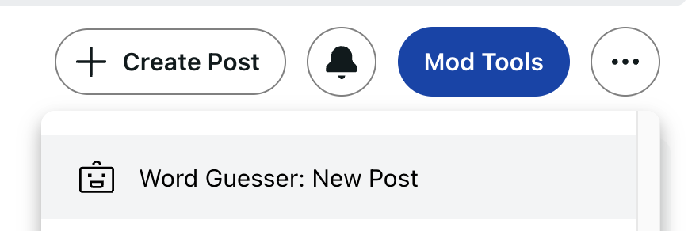
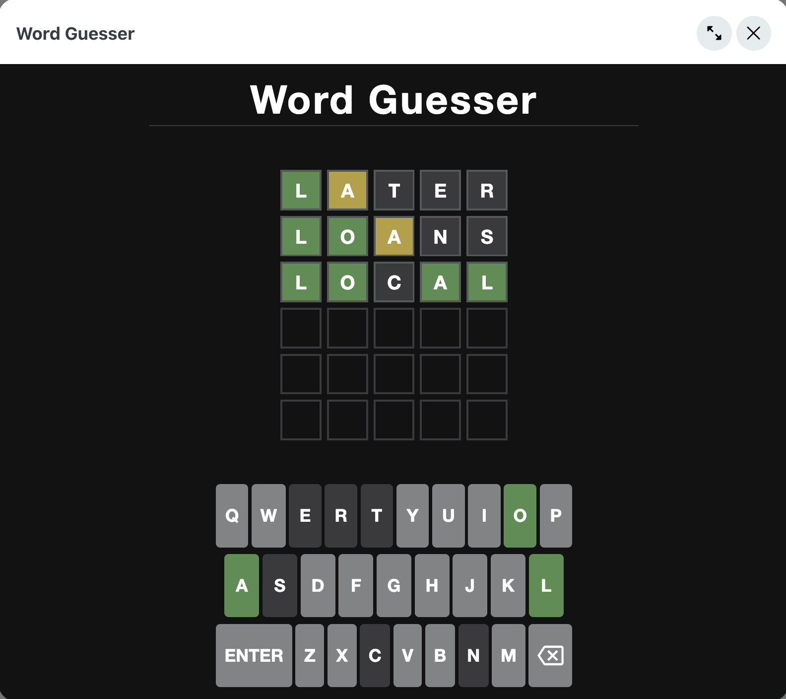

# Quickstart

Use this step-by-step guide to use our [experimental React template](https://github.com/reddit/devvit-react-starter-experimental).

1. Create your project from the template.

2. Set up your new repo.

3. Clone the repo to your computer: `git clone [url]`

4. Enter `cd your-app-name`

5. Enter `npm install`

6. Make a private subreddit on Reddit.com. This will be where you do your own development. Go to Reddit.com, scroll the left side bar down to communities, and click "Create a community."

7. Update the name in package.json. Find the dev:devvit command and replace YOUR_SUBREDDIT_NAME with the subreddit name you just created.

8. Run `npm run login` to authenticate your Reddit developer account.

9. Run `npm run deploy` and go through the prompts.

10. Run `npm run dev` and go to your subreddit to playtest your app in production. Create a post using the subreddit menu action called "Word Guesser: New Post".

11. Click **Launch App** in the post to test your app.

It's that easy!
