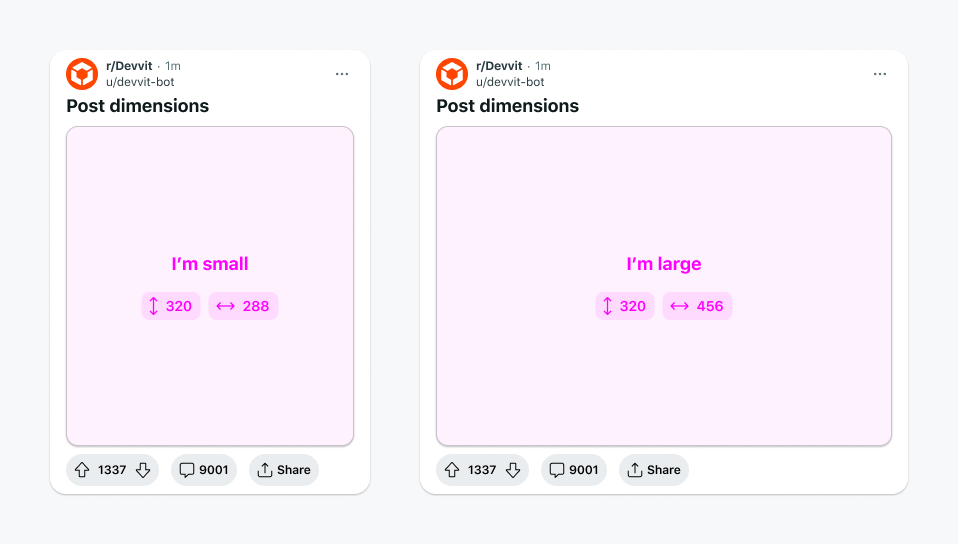

# Dimensions

Create responsive interactive posts.

Dimensions provides a way for you to create responsive interactive posts by giving you the dimensions of the root node as part of the context object. This lets you write responsive interfaces based on the space available within the context object.

Dimensions are dynamic and update in real time if the device or viewport changes. You can also resize your screen as you develop to see how your posts respond in real time. This is the same post displayed on a phone (left) and a tablet (right):



You can use dimensions to:

- Show a different experience on mobile compared to desktop (e.g., one column on mobile and two columns on desktop)
- Use pixel-based calculations for precision where percentages won’t work.

## Getting dimensions

Dimension information is specified in density-independent pixels. These pixel units are located on the context object.

| Dimension | Description                                                                                                                                                                |
| --------- | -------------------------------------------------------------------------------------------------------------------------------------------------------------------------- |
| Height    | The pixel unit height of the interactive post. This is a fixed value that will not change based on the height property provided on `Devvit.addCustomPostType`.             |
| Width     | The pixel width of the containing box for your interactive post.                                                                                                           |
| Scale     | The [pixel scale](https://developer.mozilla.org/en-US/docs/Web/API/Window/devicePixelRatio) that determines the resolution for how your custom post renders on the device. |

## Example

This example shows a custom post that specifies dimensions.

```tsx
Devvit.addCustomPostType({
  name: 'Dimensions app',
  render: (context) => {
    return context.dimensions?.width < 300 ? <SmallApp /> : <BigApp />;
  },
});
```

This example shows that dimensions always references the root element, even if it’s in a child element. Although `MyHeader` is a component within the root element, this does not change the custom post dimensions provided in the context object.

```tsx
export const MyHeader: Devvit.BlockComponent = (props, context) => {
  // Dimensions reflect the custom post, not the Header component
  const dimensions = context.dimensions;
  return (
    <vstack
      width={dimensions?.width < 500 ? '300px' : '500px'}
      height="20px"
      backgroundColor="blue"
    >
      <text>Header</text>
    </vstack>
  );
};

Devvit.addCustomPostType({
  name: 'Name',
  render: (_context) => {
    return <MyHeader />;
  },
});
```

## Limitations

- Dimensions are only for the custom post box.
- Dimensions for specific elements within the custom post box are not supported.
- Dimensions for specific device screen sizes (phone, tablet, desktop) are not supported.
