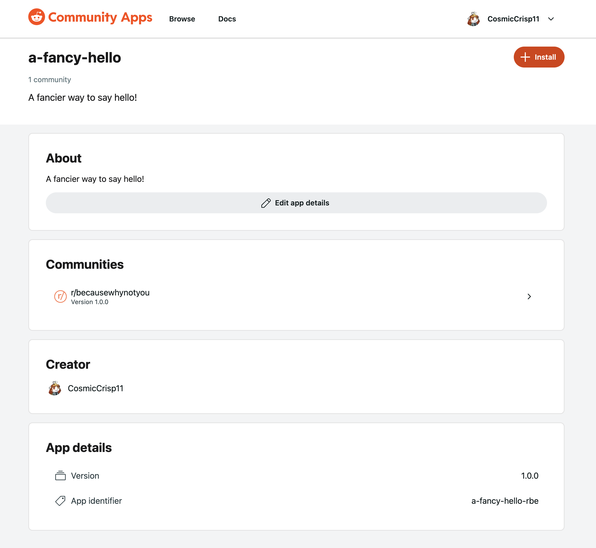

# Installing apps

## How do I install an app?

Go to the [Developer Portal](https://developers.reddit.com/apps) and select an app. This opens the app detail page. Click the red **Install** button, select the subreddit you want to add the app to, and presto! You’ve just installed an app.

