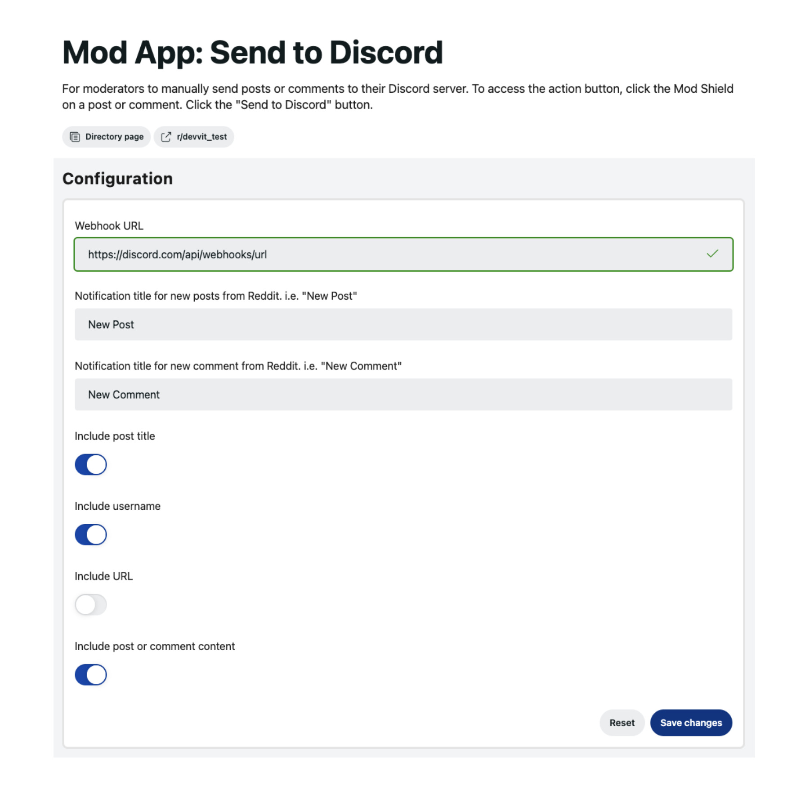
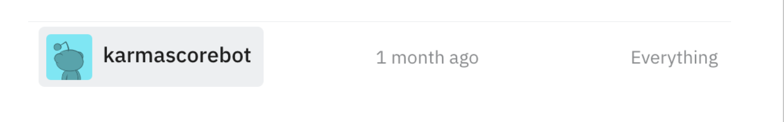

# What's an app?

An app is a program hosted and run on Reddit’s Developer Platform. Moderators can install an app on their subreddits to customize a community with bespoke mod tools, discussion bots, new governance tools, games, leaderboards, and more.

:::note
Some apps are for everyone in the community, while others are limited to moderators in the community. Moderation apps will often have buttons that show up in, or with, the mod shield icon.
:::

## How do apps work?

### App configurations

Some apps have settings that let you control how the app is configured to work on your subreddit. You can enable a specific setting or select options the developer provided to further customize your subreddit’s experience.

### App permissions

Apps may require certain permissions in order to work on your subreddit. These permissions are listed on the app detail pages in the [Community Apps](https://developers.reddit.com) directory.

Permissions fall in one of three categories.

| **Category**                   | **Description**                                                                      |
| ------------------------------ | ------------------------------------------------------------------------------------ |
| UI                             | Permissions the app needs for the UI elements it uses.                               |
| User data handling             | Permissions the app needs for the way it manages user data.                          |
| Mod permissions (required)     | Permission the app needs to create an [app account](###app-accounts) with everything |
| permissions on your subreddit. |

You can see the permissions an app requires on the app details page, install details page, and in the CLI.

### App accounts

Each app has an “app account”’ which is basically a user account for the app. The app account may take mod actions, write posts/comments, or send messages programmatically. These accounts are not human-operated or logged into.

Currently, app accounts are granted full mod permissions. In the future they will be granted more granular permissions based on the actions they need to take.

### Custom actions

Many apps use something called “custom actions,” which can be invoked when you select a cool robot icon button within a post, comment, or subreddit overflow menu. Mod-specific actions on posts and comments are located in the mod shield menu.

## Is it safe?

### Data privacy

Each installation of an app has its own data storage. This means that the data used by the app cannot interact with or share data with other communities, or with other apps . If the app you are installing uses external web services, the app will come with a separate privacy agreement with the developer.

If you uninstall an app from a subreddit, your subreddit-specific data storage instance will be deleted. Be sure you want to remove an app and all its data before you uninstall an app.

### App review

Admins review the source code and test functionality of every app made publicly available. Apps going through major updates or with greater security risk go through the review process for each new version.
