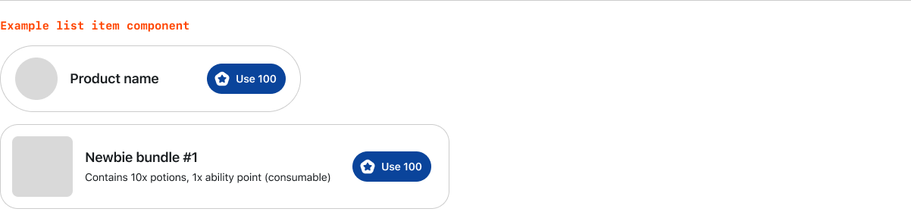
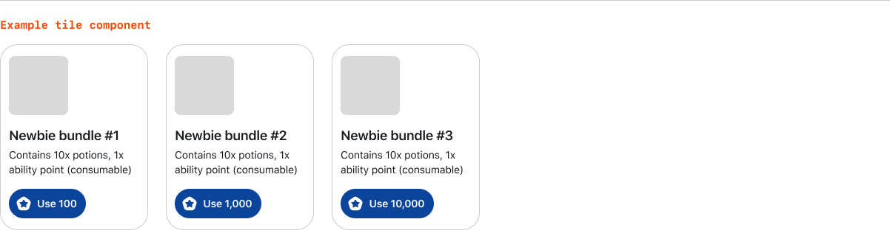
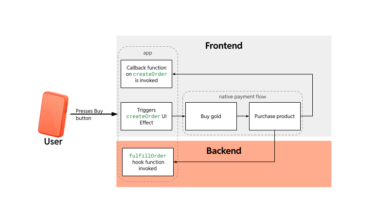

# Add payments

You can use the payments template to build your app or add payment functionality to an existing app.

To start with a template, select the payments template when you create a new project or run:

```bash
devvit new --template=payments
```

To add payments functionality to an existing app, run:

```bash
npm install @devvit/payments
```

:::note
Make sure you’re on Devvit 0.11.3 or higher. See the [quickstart](https://developers.reddit.com/docs/next/quickstart) to get up and running.
:::

## Register products

Register products in the src/products.json file in your local app. To add products to your app, run the following command:

```bash
devvit products add
```

Registered products are updated every time an app is uploaded, including when you use [Devvit playtest](../playtest).

<details>
  <summary>Click here for instructions on how to add products manually to your products.json file.</summary>
The JSON schema for the file format is available at <a href="https://developers.reddit.com/schema/products.json" target="_blank">https://developers.reddit.com/schema/products.json</a>.

Each product in the products field has the following attributes:
| **Attribute** | **Description** |
| ------------- | ------------------------------------------------------------------------------------------------------------------------------------------------------------------------------------------------------------------------------------------------------ |
| `sku` | A product identifier that can be used to group orders or organize your products. Each sku must be unique for each product in your app. |
| `displayName` | The official name of the product that is displayed in purchase confirmation screens. The name must be fewer than 50 characters, including spaces. |
| `description` | A text string that describes the product and is displayed in purchase confirmation screens. The description must be fewer than 150 characters, including spaces. |
| `price` | An predefined integer that sets the product price in Reddit gold. See details below. |
| `image.icon` | **(optional)** The path to the icon that represents your product in your [assets](../app_image_assets) folder. |
| `metadata` | **(optional)** An optional object that contains additional attributes you want to use to group and filter products. Keys and values must be alphanumeric (a - Z, 0 - 9, and - ) and contain 30 characters or less. You can add up to 10 metadata keys. Metadata keys cannot start with "devvit-". |
| `accountingType` | Categories for how buyers consume your products. Possible values are: <ul><li>`INSTANT` for purchased items that are used immediately and disappear.</li><li>`DURABLE` for purchased items that are permanently applied to the account and can be used any number of times</li><li>`CONSUMABLE` for items that can be used at a later date but are removed once they are used.</li><li>`VALID_FOR_` values indicate a product can be used throughout a period of time after it is purchased.</li></ul> |

</details>

## Price products

Product prices are predefined and must be one of the following gold values:

- 5 gold ($0.10)
- 25 gold ($0.50)
- 50 gold ($1)
- 100 gold ($2)
- 150 gold ($3)
- 250 gold ($5)
- 500 gold ($10)
- 1000 gold ($20)
- 2500 gold ($50)

:::note
Actual payments will not be processed until your products are approved. While your app is under development, you can use sandbox payments to [simulate purchases](#simulate-purchases).
:::

## Design guidelines

You’ll need to clearly identify paid products or services. Here are some best practices to follow:

- Use a short name, description, and image for each product.
- Don’t overwhelm users with too many items.
- Try to keep purchases in a consistent location or use a consistent visual pattern.
- Only use the gold icon to indicate purchases for Reddit gold.

### Product image

Product images need to meet the following requirements:

- Minimum size: 256x256
- Supported file type: .png

If you don’t provide an image, the default Reddit product image is used.


**Example**

```json
{
  "$schema": "https://developers.reddit.com/schema/products.json",
  "products": [
    {
      "sku": "god_mode",
      "displayName": "God mode",
      "description": "God mode gives you superpowers (in theory)",
      "price": 25,
      "images": {
        "icon": "products/extra_life_icon.png"
      },
      "metadata": {
        "category": "powerup"
      },
      "accountingType": "CONSUMABLE"
    }
  ]
}
```

### Purchase buttons (required)

#### Blocks

The `ProductButton` is a Devvit blocks component designed to render a product with a purchase button. It can be customized to match your app's look and feel.

**Usage:**

```tsx
<ProductButton
  showIcon
  product={product}
  onPress={(p) => payments.purchase(p.sku)}
  appearance="tile"
/>
```

##### `ProductButtonProps`

| **Prop Name**      | **Type**                                        | **Description**                                                                      |
| ------------------ | ----------------------------------------------- | ------------------------------------------------------------------------------------ |
| `product`          | `Product`                                       | The product object containing details such as `sku`, `price`, and `metadata`.        |
| `onPress`          | `(product: Product) => void`                    | Callback function triggered when the button is pressed.                              |
| `showIcon`         | `boolean`                                       | Determines whether the product icon is displayed on the button. Defaults to `false`. |
| `appearance`       | `'compact'` &#124; `'detailed'` &#124; `'tile'` | Defines the visual style of the button. Defaults to `compact`.                       |
| `buttonAppearance` | `string`                                        | Optional [button appearance](../blocks/button#appearance).                           |
| `textColor`        | `string`                                        | Optional [text color](../blocks/text#color).                                         |

#### Webviews

Use Reddit’s primary, secondary, or bordered button component and gold icon in one of the following formats:


Use a consistent and clear product component to display paid goods or services to your users. Product components can be customized to fit your app, like the examples below.






## Complete the payment flow

Use `addPaymentHandler` to specify the function that is called during the order flow. This customizes how your app fulfills product orders and provides the ability for you to reject an order.

Errors thrown within the payment handler automatically reject the order. To provide a custom error message to the frontend of your application, you can return {success: false, reason: <string>} with a reason for the order rejection.

This example shows how to issue an "extra life" to a user when they purchase the "extra_life" product.

```ts
import { type Context } from '@devvit/public-api';
import { addPaymentHandler } from '@devvit/payments';
import { Devvit, useState } from '@devvit/public-api';

Devvit.configure({
  redis: true,
  redditAPI: true,
});

const GOD_MODE_SKU = 'god_mode';

addPaymentHandler({
  fulfillOrder: async (order, ctx) => {
    if (!order.products.some(({ sku }) => sku === GOD_MODE_SKU)) {
      throw new Error('Unable to fulfill order: sku not found');
    }
    if (order.status !== 'PAID') {
      throw new Error('Becoming a god has a cost (in Reddit Gold)');
    }

    const redisKey = godModeRedisKey(ctx.postId, ctx.userId);
    await ctx.redis.set(redisKey, 'true');
  },
});
```

## Implement payments

The frontend and backend of your app coordinate order processing.



To launch the payment flow, create a hook with `usePayments()` followed by `hook.purchase()` to initiate the purchase from the frontend.

This triggers a native payment flow on all platforms (web, iOS, Android) that works with the Reddit backend to process the order. The `fulfillOrder()` hook calls your app during this process.

Your app can acknowledge or reject the order. For example, for goods with limited quantities, your app may reject an order once the product is sold out.

### Get your product details

Use the `useProducts` hook or `getProducts` function to fetch details about products.

```tsx
import { useProducts } from '@devvit/payments';

export function ProductsList(context: Devvit.Context): JSX.Element {
  // Only query for products with the metadata "category" of value "powerup".
  // The metadata field can be empty - if it is, useProducts will not filter on metadata.
  const { products } = useProducts(context, {
    metadata: {
      category: 'powerup',
    },
  });

  return (
    <vstack>
      {products.map((product) => (
        <hstack>
          <text>{product.name}</text>
          <text>{product.price}</text>
        </hstack>
      ))}
    </vstack>
  );
}
```

You can also fetch all products using custom-defined metadata or by an array of skus. Only one is required; if you provide both then they will be AND’d.

```tsx
import { getProducts } from '@devvit/payments';
const products = await getProducts({,
});
```

### Initiate orders

Provide the product sku to trigger a purchase. This automatically populates the most recently-approved product metadata for that product id.

**Example**

```tsx
import { usePayments } from '@devvit/payments';

// handles purchase results
const payments = usePayments((result: OnPurchaseResult) => { console.log('Tried to buy:', result.sku, '; result:', result.status); });

// for each sku in products:
<button onPress{payments.purchase(sku)}>Buy a {sku}</button>
```
