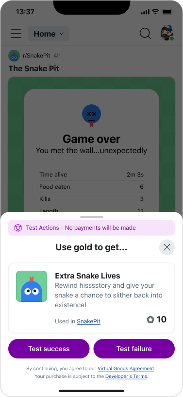

# Test payments

Use the payments sandbox environment to simulate payment transactions. All apps automatically start in the payments sandbox.

## Start a playtest

To test your app:

1. Run `devvit upload` to upload your app to the Apps directory.
2. Run `devvit playtest` <test-subreddit-name> .

Once you start a playtest session, a new pre-release version of your app is automatically created and installed on your test subreddit. The pre-release version has a fourth decimal place, so if your current app is 0.0.1, the first pre-release version will be 0.0.1.1.

The pre-release version is updated and uploaded to your test subreddit every time you save your app code. You’ll need to refresh your subreddit to see the updated app. This may take a couple of seconds, so be patient.

## Simulate purchases

In your test subreddit, you can make simulated purchases to test your app. No gold deducted in this state.

To end your playtest, press CTRL + C in the terminal session where you started it.
