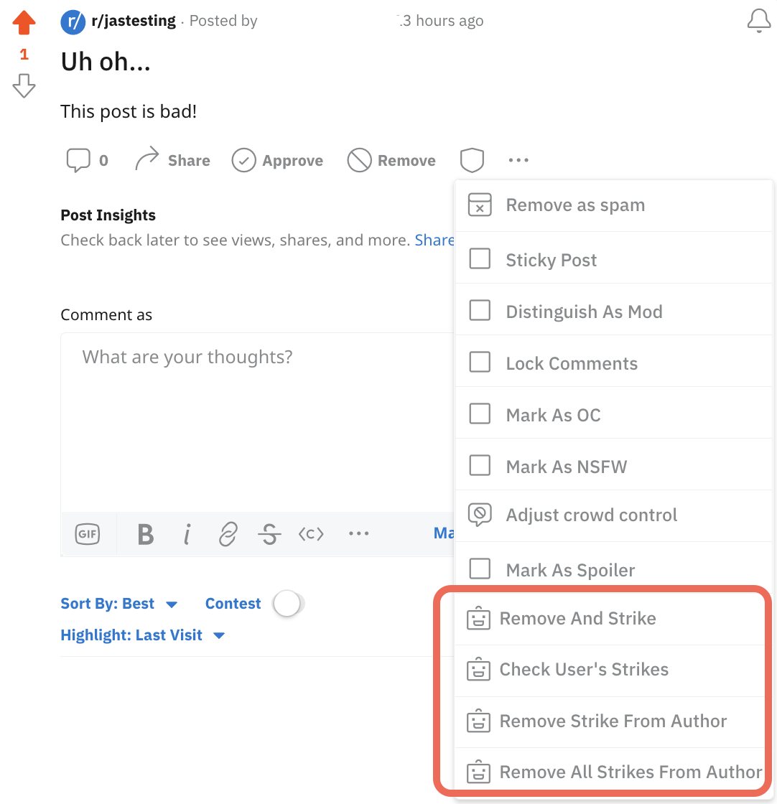
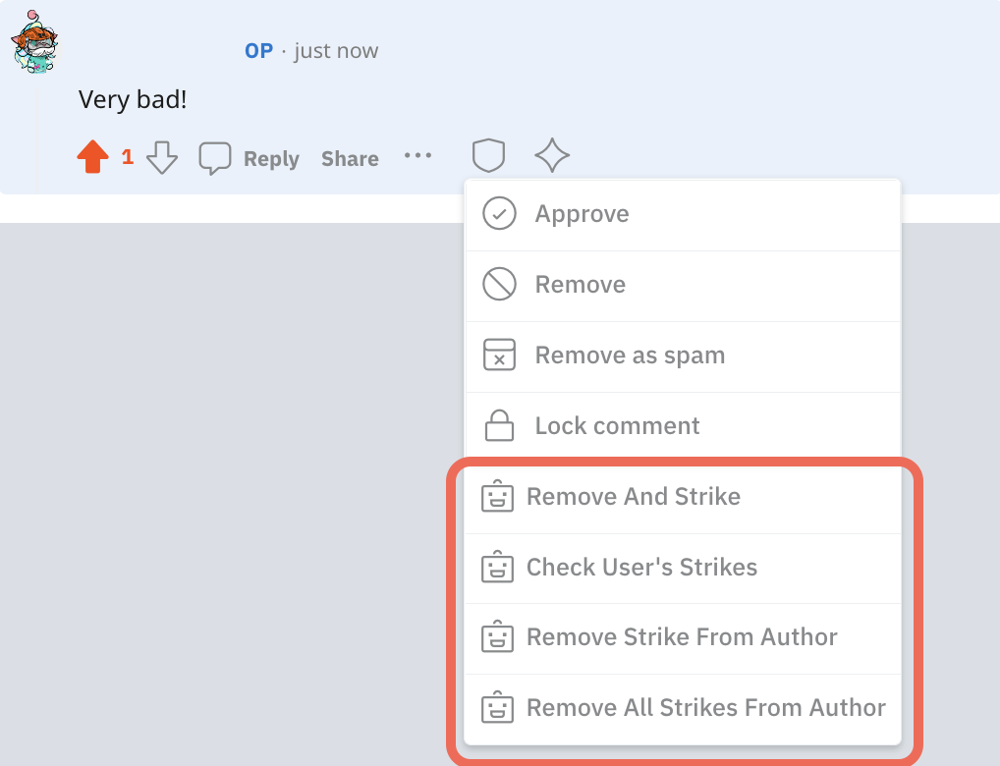
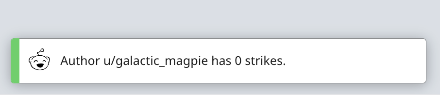
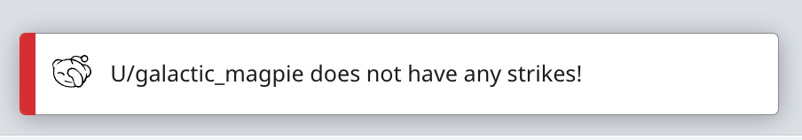

# Three strikes tutorial

Use Redis, create an author key, and add menu actions to create a mod tool.

This app allows a moderator to remove rule-breaking content and use a "three strike" system to manage users who violate community rules. The penalties become more severe with each strike:

**Strike 1**: Sends a private warning message the user.  
**Strike 2**: Bans the user from the community for one day.  
**Strike 3**: Bans the user from the community for one year.

| Post menu                                                  | Comment menu                                                     |
| ---------------------------------------------------------- | ---------------------------------------------------------------- |
|  |  |

## Start a project

To create a Three Strikes app, use the default empty [template](../../get-started/create-app.md#templates) to start a new project.

1. From the terminal, navigate to a directory where you'll store your project.
2. Enter the following command to create a project folder on your local machine.

```bash
devvit new <replace-with-your-app-name>
```

3. In your new project, open `main.ts` in your code editor (we recommend VS Code).

```bash
your-app-name
├── devvit.yaml
├── package-lock.json  # If you use yarn, this will be yarn.lock
├── package.json
├── src
│   └── main.ts     # <- the main code is here (ignore the rest for now)
├── tsconfig.json
```

4. Add the following code to the top of the `main.ts' file (you can replace the existing import statement).

```typescript
import { Devvit, MenuItemOnPressEvent, User } from '@devvit/public-api';
```

Importing this code adds core classes and plugins from the Reddit Developer Platform (`@devvit/public-api`).

5. Add the [Redis plugin](/docs/capabilities/redis.md). This plugin allows you to store data in your app that will be there the next time it’s run. You also need to enable access to the Reddit API.

```typescript
Devvit.configure({
  redis: true,
  redditAPI: true,
});
```

## Create helper methods

### Create an author key

Redis lets you store data in your app (for example, the number of strikes a user has). Each uniquely identified key is paired with an associated value and is available every time the app is run.

6. For the three strikes app, you’ll create a key for the author of the post or comment, where \{author} is a Reddit username and the associated value is the user’s strike value.

```typescript
/**
 * Creates a Redis key for the author
 */
function getKeyForAuthor(author: User) {
  return `$\{author.id}_strikes`;
}
```

### Get the offending post or comment

7. Add a function that will take the onPress event and retrieve the associated post or comment

```typescript
async function getThing(event: MenuItemOnPressEvent, context: Devvit.Context) {
  if (event.location === 'post') {
    return await context.reddit.getPostById(event.targetId);
  } else if (event.location === 'comment') {
    return await context.reddit.getCommentById(event.targetId);
  }
  throw 'Cannot find a post or comment with that ID';
}
```

### Get the author of the post or comment

8. Add a function that will get the author of the post or comment

```typescript
async function getAuthor(event: MenuItemOnPressEvent, context: Devvit.Context) {
  const thing = await getThing(event, context);
  return await context.reddit.getUserById(thing.authorId!);
}
```

## Add mod menu functionality

Strike functionality is added to the mod menu so that the moderator can remove rule-breaking content and manage users who violate the community’s guidelines. Add the following code to your `main.ts` file.

### Check user's strikes

This function determines if the author currently has any strikes.

9. Add the `getAuthorStrikes` function to sync with the Redis plugin.

```typescript
async function getAuthorStrikes(author: User, context: Devvit.Context) {
  const key = getKeyForAuthor(author);
  return ((await context.redis.get(key)) as number) || 0;
}
```

10. Add the `checkStrikes` function to get data from the post or comment.

```typescript
async function checkStrikes(event: MenuItemOnPressEvent, context: Devvit.Context) {
  const author = await getAuthor(event, context);
  const strikes = await getAuthorStrikes(author, context);
  context.ui.showToast(`Author u/$\{author.username} strike count: ${strikes}`);
}
```

When this option is selected from the mod menu, a toast returns the number of strikes at the bottom of the page.



### Remove strike from author

This function allows the moderator to change a user’s strike count.

11. Add the `setAuthorStrikes` function to update the strike counter in the Redis plugin.

```typescript
async function setAuthorStrikes(author: User, strikes: number, context: Devvit.Context) {
  const key = getKeyForAuthor(author);
  await context.redis.put(key, strikes);
}
```

12. Add the `removeStrike` function to check the metadata in the Redis plugin and update the strike counter for the author.

```typescript
async function removeStrike(event: MenuItemOnPressEvent, context: Devvit.Context) {
  // Get some relevant data from the post or comment
  const author = await getAuthor(event, context);
  let strikes = await getAuthorStrikes(author, context);

  if (strikes > 0) {
    await setAuthorStrikes(author, --strikes, context);
    context.ui.showToast(
      `Removed a strike from u/$\{author.username}. Remaining strikes: ${strikes}.`
    );
    return;
  }

  context.ui.showToast(`u/$\{author.username} does not have any strikes!`);
}
```

If a mod attempts to remove a strike when a user’s strike count is zero, an error toast appears at the bottom of the screen.



### Remove all strikes from author

This function updates metadata in the Redis plugin and resets the strike counter for the author to zero.

13. Add the `clearStrikes` function.

```typescript
async function clearStrikes(event: MenuItemOnPressEvent, context: Devvit.Context) {
  // Get some relevant data from the post or comment
  const author = await getAuthor(event, context);
  const hadStrikes = await getAuthorStrikes(author, context);

  if (hadStrikes > 0) {
    await setAuthorStrikes(author!, 0, context);
    context.ui.showToast(
      `Cleared ${hadStrikes} strike${hadStrikes !== 1 ? 's' : ''} from u/$\{author.username}!`
    );
    return;
  }

  context.ui.showToast(`u/$\{author.username} does not have any strikes!`);
}
```

### Remove and strike

This function shows the mod where the action came from, pulls relevant data from the post or comment (including name, author, and permalink), and adds a strike to the user’s account. Then the content is removed by the [Reddit Remove Post API](https://www.reddit.com/dev/api#POST_api_remove). If this is the third strike for a user, the [Reddit Friend API](https://www.reddit.com/dev/api#POST_api_friend) bans the user from the community.

14. Add the `strike` function.

```typescript
async function strike(event: MenuItemOnPressEvent, context: Devvit.Context) {
  // Use the correct term in our message based on what was acted upon
  const thing = await getThing(event, context);
  const author = await getAuthor(event, context);
  /**
   * Remove the content
   * See: https://www.reddit.com/dev/api#POST_api_remove
   *
   * NOTE: Apps are executed as the moderator that installed this app and
   *       must have permission to remove content for this to work!
   */
  await thing!.remove();

  // Add a strike to the user and persist it to the Redis plugin
  let strikes = await getAuthorStrikes(author, context);
  await setAuthorStrikes(author, ++strikes, context);

  // What we'll send the user in a private message
  let pmMessage = '';
  // Used to tell the moderator what punishment the user received
  let punishment = '';
  // Ban if they're on their 2nd or 3rd strike
  let ban = true;
  // We'll determine how long the ban lasts based on how many strikes they have
  let days = 0;

  // Get the current subreddit from the metadata
  const subreddit = await context.reddit.getCurrentSubreddit();
  const permalink = thing.permalink;
  const location = event.location;
  switch (strikes) {
    case 1:
      // first strike, send a warning
      pmMessage = `You have received a strike and your ${location} has been removed from ${subreddit.name} for breaking the rules. Another strike will result in a 1-day ban.\n\n${permalink}`;
      punishment = `sent a warning`;
      ban = false;
      break;
    case 2:
      // second strike, temp ban, warn again
      days = 1;
      pmMessage = `You have received your second strike and your ${location} has been removed from ${subreddit.name} and you have been banned for 1 day for breaking the rules.\n\nONE MORE STRIKE WILL RESULT IN A 1-YEAR BAN FROM THIS SUBREDDIT.\n\n${permalink}`;
      punishment = `banned for 1 day`;
      break;
    case 3:
    default:
      // third (and any subsequent strikes), ban for 1 year from now
      days = 365;
      pmMessage = `You have been banned from ${subreddit.name} for one year for receiving ${strikes} strikes for your ${location}.\n\n${permalink}`;
      punishment = `banned for 1 year`;
      break;
  }

  /**
   * Send a private message to the user
   * See: https://www.reddit.com/dev/api#POST_api_compose
   *
   * NOTE: Apps are executed as the moderator that installed this app into a
   *       subreddit and will be used as the user that sends this message!
   */
  await context.reddit.sendPrivateMessage({
    to: author.username,
    subject: `Received a strike on ${subreddit.name}`,
    text: pmMessage,
  });

  const result = `u/$\{author.username} strikes: ${strikes} and has been ${punishment}.`;

  if (ban) {
    const currentUser = await context.reddit.getCurrentUser();
    await context.reddit.banUser({
      subredditName: subreddit.name,
      username: author.username,
      duration: days,
      context: thing!.id,
      reason: `Received ${strikes} strike${strikes !== 1 ? 's' : ''} for breaking subreddit rules`,
      note: `Strike added by ${currentUser.username}`,
    });
  }

  context.ui.showToast(result);
}
```

### Compose a message

When a mod selects the **Remove and strike** menu option, a private message is sent to the user with the appropriate warning based on the user’s number of strikes. There is boilerplate text in the [strike functionality](#Remove-and-strike) you added earlier. If you would like to modify the messages, edit that file under the appropriate strike count.

## Add menu actions

You can use the `Devvit.addMenuItem` method to add menu names to functions you just set up. This is where you determine where the menu actions will show up (for example, setting location: 'post' means that your menu action will appear in the moderation menu of a post). The `onPress` parameter defines the function that is called when the action is invoked.

15. Use `Devvit.addMenuItem` to create a new overflow menu item called "Three Strikes".

```typescript
/**
 * Declare our custom mod-only actions and add it to Posts and Comments
 */
Devvit.addMenuItem({
  label: 'Remove and Strike',
  location: ['post', 'comment'],
  forUserType: 'moderator',
  onPress: strike,
});

Devvit.addMenuItem({
  label: `Check User's Strikes`,
  location: ['post', 'comment'],
  forUserType: 'moderator',
  onPress: checkStrikes,
});

Devvit.addMenuItem({
  label: 'Remove Strike from Author',
  location: ['post', 'comment'],
  forUserType: 'moderator',
  onPress: removeStrike,
});

Devvit.addMenuItem({
  label: 'Remove All Strikes from Author',
  location: ['post', 'comment'],
  forUserType: 'moderator',
  onPress: clearStrikes,
});
```

## Complete the project

You’ll know your project is complete when you see the following (kinda cryptic) line at the end of your code.

```typescript
export default Devvit;
```

All of the code above this line modified the core Devvit object. This line simply makes the updated Devvit object (which now implements the Three Strikes app) available to the Reddit Developer Platform. When this new instance of Devvit is installed on a subreddit, it will contain the three strikes menu shortcut and the logic you just wrote to make it work.

### Upload your app

Your app is now ready to upload! Move into the top-level directory and use `devvit upload` to upload your app to the Reddit Developer Platform. Make sure to install this in a subreddit you moderate.

```bash
`your-app-name      # <- you should be here
├── devvit.yaml
├── package-lock.json  # If you use yarn, this will be yarn.lock
├── package.json
├── src
│   └── main.ts
├── tsconfig.json
```

### Use your app

When you want to use the Three Strikes app, click on the mod menu (shaped like a shield) and select the appropriate action.

| Post menu                                                  | Comment menu                                                     |
| ---------------------------------------------------------- | ---------------------------------------------------------------- |
|  |  |

## Next steps

Congratulations on getting your Three Strikes app running! Next up: add [logging](../../debug) to your app to help you debug.
