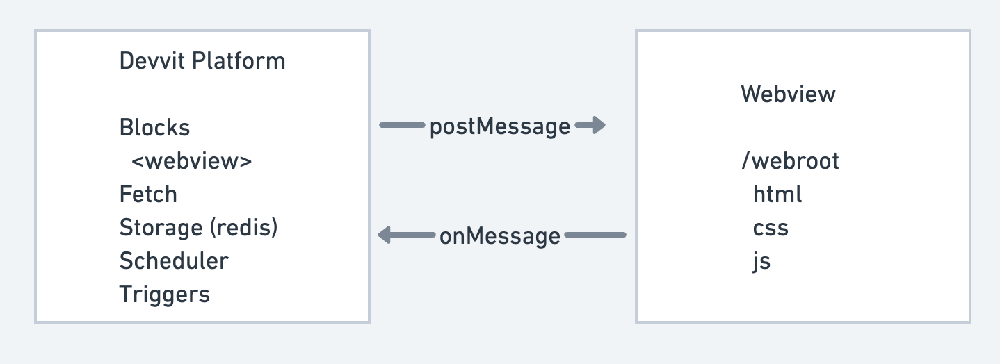

# Web views

Web views allow you to include HTML, CSS, and JavaScript and have it run within your Reddit app. This gives you full control over your app's appearance and behavior while running within Reddit's platform.

## Migration guide

<details>
  <summary>Click here for instructions on how to migrate from the web view component to the new useWebView hook.</summary>
  <div>
    <div>

This migration guide helps you migrate from using the web view component with visibility toggle, as used in our web-view-post template, to using the new useWebView hook. This will give you access to more gestures and sounds, and make sure your apps are performant in Reddit feeds.

**Overview**

The `useWebView` hook simplifies web view management with three main parameters:

- url: The URL of your web view content
- onMessage: Handler for messages from the web view
- onUnmount: Cleanup function that runs when the web view is closed

Instead of managing visibility with state, you'll use the mount function returned by the hook to open the web view.

**Before (web view component)**

```ts
// Managing visibility with state
const [webViewVisible, setWebViewVisible] = useState(false);

// Message handler
const onMessage = async (msg) => {
  if (msg.type === 'setCounter') {
    await context.redis.set(`counter_${context.postId}`, msg.data.newCounter.toString());
    setCounter(msg.data.newCounter);
  }
};

return (
  <vstack>
    <button onPress={() => setWebViewVisible(true)}>Launch App</button>
    {webViewVisible ? <webview id="myWebView" url="page.html" onMessage={onMessage} /> : null}
  </vstack>
);
```

**After (useWebView hook)**

```ts
import { useWebView } from '@devvit/public-api';

// Using useWebView hook
const { mount } = useWebView({
  // URL of your web view content
  url: 'page.html',

  // Message handler
  onMessage: async (message, webView) => {
    if (message.type === 'setCounter') {
      await context.redis.set(`counter_${context.postId}`, message.data.newCounter.toString());
      setCounter(message.data.newCounter);
    }
  },

  // Cleanup when web view is closed
  onUnmount: () => {
    context.ui.showToast('Web view closed!');
  },
});

return (
  <vstack>
    <button onPress={mount}>Launch App</button>
  </vstack>
);
```

**Key Differences**

1. Opening the web view

Old: Web view component was open immediately
The old web-view-post template toggled visibility with state (setWebViewVisible(true))

New: Use mount function from the hook

2. Message Handling

Old: Separate onMessage function passed as a parameter to component
New: Defined directly in useWebView parameters, along with access to an onUnmount function

3. Cleanup

Old: N/A
New: onUnmount parameter handles callback after cleanup

</div>
    <br/>
  </div>
</details>

Supported platforms:

- iOS (v2025.05)
- Android (v2025.05)
- Web

## Getting started

Create a new web view project:

```bash
devvit new --template web-view-post
cd my-project
```

Your project structure will look like this.

```
my-project/
├── webroot/          # All web content goes here
│   ├── page.html     # Main HTML file
│   ├── styles.css    # Stylesheets
│   └── app.js        # JavaScript code
└── src/
    └── main.tsx      # Devvit app code
```

## useWebView

The `useWebViewHook` integrates web views into your Devvit app. This opens a large viewport (full screen on mobile and a modal on web) and provides a clean interface for managing the web view lifecycle and communication.

### Syntax

```typescript
/** Message from Devvit to the web view. */
export type DevvitMessage =
  | { type: 'initialData'; data: { username: string; currentCounter: number } }
  | { type: 'updateCounter'; data: { currentCounter: number } };

/** Message from the web view to Devvit. */
export type WebViewMessage =
  | { type: 'webViewReady' }
  | { type: 'setCounter'; data: { newCounter: number } };

const { mount, unmount, postMessage } = useWebView<WebViewMessage, DevvitMessage>({
  url: 'page.html',
  onMessage: (message, webView) => {},
  onUnmount: () => {},
});
```

- url: the path to your HTML file relative to the webroot directory (defaults to ‘index.html’ if unspecified)
- onMessage: callback function that handles messages received from the web view; it receives two parameters:
  - message: the data sent from the web view via postMessage
  - webView: an object containing methods to interact with the web view
- onUnmount (optional): callback function that runs when the web view is closed. This does not fire on navigation or closing the browser tab.

Return values:

- mount: function to programmatically open the web view
- unmount: function to programmatically close the web view
- postMessage: function to send a message to the web view

### Basic example

```typescript
const App = () => {
  const { mount } = useWebView({
    // URL of your web view content
    url: 'page.html',

    // Handle messages from web view
    onMessage: (message) => {
      console.log('Received from web view:', message);
    },

    // Cleanup when web view closes
    onUnmount: () => {
      console.log('Web view closed');
    },
  });

  return <button onPress={mount}>Launch App</button>;
};
```

Be sure to call `mount` after some user interaction, like a button press, so that it's clear to the user what initiated the fullscreen presentation.

:::note
Web views that are presented in fullscreen without user interaction will not be approved.
:::

## Best practices

### UI/UX patterns

- Handle responsive views across mobile and desktop devices
- Call mount only after user interaction (e.g. onPress)

### File organization

- Keep all web files in the webroot/ directory
- Use separate files for HTML, CSS, and JavaScript
- Consider using a bundler for larger applications

### Data Synchronization

- Cache data in localStorage where appropriate
- Wait to send messages to the web view until the web view is fully loaded

## Known limitations

### CSS/JS requirements

- ❌ No inline CSS or JavaScript
- ✅ Use separate .css and .js files

### Forms

- ❌ No direct form submissions
- ✅ Use JavaScript to handle form data
- ✅ Send data via postMessage

## Communication between Devvit and web view

Web views let you build custom UIs with HTML/CSS/JS while accessing Devvit's backend services ([Redis](./capabilities/redis.md), [fetch](./capabilities/http-fetch.md), [scheduler](./capabilities/scheduler.md), [triggers](./capabilities/triggers.md)) via message passing between the two contexts.



### From web view to Devvit

In your web view JavaScript:

```javascript
// app.js
window.parent.postMessage(
  {
    type: 'userAction',
    data: { clicked: true },
  },
  '*'
);
```

In your Devvit app:

```typescript
// main.tsx
const { mount } = useWebView({
  url: 'page.html',
  onMessage: (message, webView) => {
    if (message.type === 'userAction') {
      console.log('User clicked:', message.data.clicked);
    } else if (message.type === 'unmount') {
      webView.unmount();
    }
  },
});
```

### From Devvit to web view

In your Devvit app:

```typescript
// main.tsx
const { mount } = useWebView({
  url: 'page.html',
  onMessage: (message, webView) => {
    if (message.type === 'userAction') {
      console.log('User clicked:', message.data.clicked);
      webView.postMessage({
        type: 'userActionHandled',
        data: { userActionComplete: true },
      });
    }
  },
});
```

In your web view JavaScript:

```javascript
// app.js
window.addEventListener('message', (event) => {
  if (event.data.type === 'devvit-message') {
    const { message } = event.data;
    console.log('Received from Devvit:', message);
  }
});
```

## Managing state

### Handling initial state

Use `postMessage` to inject the initial state from the Devvit app into the web view after it is mounted. To ensure the web view is loaded before sending messages to it, send a message to the Devvit app requesting the initial state.

#### From web view to Devvit

In your web view JavaScript:

```javascript
// app.js
// Inform the Devvit app that the web view is ready to receive messages
addEventListener('load', (event) => {
  window.parent.postMessage({ type: 'webViewReady' }, '*');
});
```

In your Devvit app:

```typescript
// main.tsx
const { mount } = useWebView({
  url: 'page.html',
  onMessage: (message, webView) => {
    if (message.type === 'webViewReady') {
      webView.postMessage({ data: { score: 44 } });
    }
  },
});
```

### Local state

Persist local state using `localStorage`, which is fast, secure, and available on all platforms.

Web views can use `localStorage` for client-side persistence:

```javascript
// Save data
localStorage.setItem('gameState', JSON.stringify(state));

// Load data
const savedState = localStorage.getItem('gameState');
```

### Server state

To allow for state to sync across devices, data should be persisted using Redis within the Devvit app. It's recommended to frequently store state using `localStorage`, which is faster and use Redis less frequently.

```typescript
const App = () => {
  // Load data from Redis
  const [counter] = useState(async () => {
    const value = await context.redis.get(`counter_${context.postId}`);
    return Number(value ?? 0);
  });

  const { mount } = useWebView({
    url: 'page.html',
    onMessage: async (message) => {
      if (message.type === 'updateCounter') {
        // Update Redis
        await context.redis.set(`counter_${context.postId}`, message.data.newValue);
      }
    },
  });

  return <button onPress={mount}>Open App</button>;
};
```

## Adding payments

Adding [payments](payments/payments_add.md) to your app is pretty straightforward, but there are a couple of things to you need to know when also using web views.

For a full working example, see `devvit new --template=payments-web-view`.

### Using events to handle payments

Your user will interact with a web view, but payments APIs can only be invoked in blocks. To make this work, you need to:

- Use events (from web view to Devvit) to communicate that the user wants to purchase a product.
- Use events (from Devvit to the web view) to communicate whether purchase succeeds and what the user purchased.

### Communicating between web view and payments

Both your web view and payments integrations need to be declared in the same `addCustomPostType` block. At that point, the lambdas given to each integration will be able to reference each other:

```typescript
const payments = usePayments((result: OnPurchaseResult) => {
  // Tell the web view that a purchase was made.
  // A full example might validate that the purchase was successful & communicate what was purchased.
  webView.postMessage({
    type: 'purchaseMade',
    data: {},
  });
});
const webView = useWebView<WebViewMessage, DevvitMessage>({
  url: 'page.html',
  async onMessage(message) {
    // Trigger a payment, based on user interaction in the web view.
    // A full example might check that the user is eligible to make the purchased indicated -
    // for instance validating they aren't trying to purchase something they've already purchased
    // or are otherwise ineligible to purchase.
    if (message.type === 'purchase') {
      payments.purchase(message.data.sku);
    }
  },
});
```
